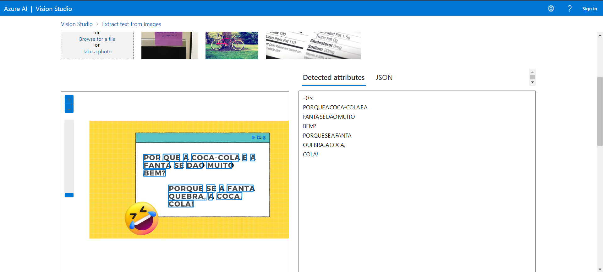

# AzureAiVision
Uso da plataforma Azure AI Vision para a Visão Computacional

## Serviços de visão computacional no Azure

Visão:

- Análise de imagem.
- Marcação de imagens, legendas, personalização de modelos e muitos mais.
- Reconhecimento Óptico de Caracteres (OCR).
- Análise espacial.

Face:

- Detecção de rosto
- Reconhecimento facial

Link do Azure AI Vision: **portal.vision.cognitive.azure.com**

## Análise de imagem 4.0 com AI Vision Service

Os recursos incluem:

- Personalização do modelo
- Ler texto de imagens
- Detecte pessoas em imagens
- Gerar legenda de imagens
- Detectar objetos
- Marcar recursos visuais
- Corte inteligente

## Detectando rostos com o Face Service

Qualquer pessoa pode usar o Face Service para detectar:

- Desfoque: quão desfocado está o rosto.
- Exposição: aspectos como ruído: refere-se ao ruído visual na imagem.
- Óculos: se a pessoa estiver usando óculos
- Pose da cabeça: a orientação do rosto em um espaço 3D
- Oclusão: determina se pode haver objetos bloqueando o rosto na imagem

Somente clientes gerenciados da Microsoft podem acessar recursos de reconhecimento facial:

- Correspondência de similaridade
- Verificação de Identidade

Pois se tratam de informações sigilosas.

## Lendo texto com reconhecimento óptico de caracteres (OCR)

Detectar a localização do texto:

- Impresso
- Escrito à mão
- Opções para extração rápida de texto de imagens ou análise assíncrona de documentos digitalizados maiores.